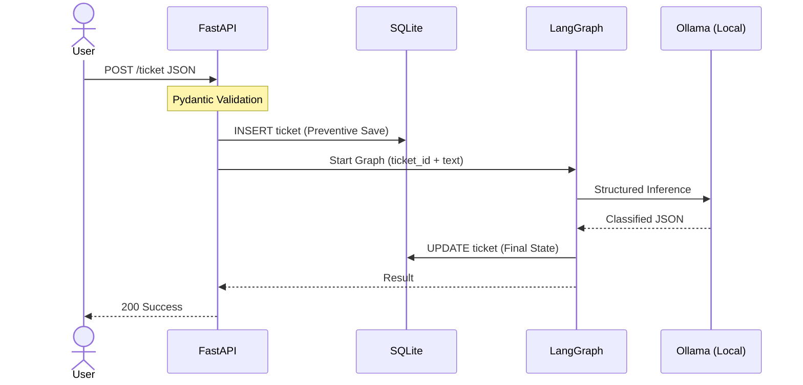
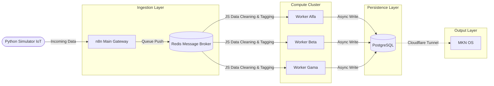

# Hi there, I'm Gabriel Molina 👋
### AI Systems Architect | Deterministic Agentic Workflows | Builder

 
 

+Do+->+Reflect;Engineering+Deterministic+Agents" alt="Typing SVG" />

---

### 🚀 Engineering Philosophy
> *I build systems that are Deterministic by Design. I thrive at the intersection of creative problem-solving and rigorous engineering, moving beyond linear scripts to create **intelligence-driven architectures**. Whether it's a local LLM reasoning engine or an event-driven orchestrator, my focus is on building agents that actually close the loop—reflecting and adjusting based on real outcomes—while ensuring 100% data integrity.*

---

### 🛠️ Technical Arsenal

| **🧠 The Brain (AI)** | **⚙️ The Engine (Backend)** | **⚡ The Logic (Orch)** |
| :---: | :---: | :---: |
|    |    |    |

---

## 🏆 High-Impact Projects (The Sandbox)

 

### 🎫 [LangKit: Agentic AI Ticket Intelligence](https://github.com/IGabrielMolina/LangKit)

> **Engineering Focus:** Agentic Workflows, Service-Oriented Architecture (SOA), and Preventive Persistence.

A production-ready **Agentic Orchestrator** combining decoupled services with state-machine AI logic for local, privacy-first execution.

**Agentic Orchestration:** Engineered a Directed Acyclic Graph (DAG) using `LangGraph` to handle complex LLM feedback loops and self-correction cycles, effectively **closing the loop** on non-deterministic AI outputs.

**Service-Oriented Architecture (SOA):** Separated inference (local Ollama), business logic (FastAPI), and frontend (Streamlit) into isolated, dockerized containers to ensure system resilience.

**Preventive Persistence:** Implemented a Write-Ahead Logging pattern with SQLite to guarantee zero data loss during unpredictable LLM inference failures or hardware limits.

**Strict Deterministic Validation:** Enforced highly structured JSON outputs leveraging `Pydantic` and Qwen 2.5 14B, eliminating hallucinated formatting and ensuring API compliance.

    

 

 

 

### 🚀 [Industrial-Grade Data Ingestion Pipeline](https://github.com/IGabrielMolina/stress-test-mkn)

> **Engineering Focus:** Distributed Systems, Backpressure Management, and Fault Tolerance.

A highly scalable, fault-tolerant **Proof of Concept (PoC)** designed to handle massive telemetry data spikes without data loss or gateway timeouts.

**Decoupled Architecture:** Engineered a queue-based system utilizing a message broker to separate API ingestion from database writing, effectively mitigating backpressure during traffic spikes.

**Horizontal Scalability:** Deployed a cluster of isolated worker nodes capable of asynchronously processing high-volume loads (e.g., IoT sensors, bulk ERP migrations) without crashing the main gateway.

**Real-Time Telemetry:** Implemented a live monitoring dashboard to track cluster health, worker distribution, and database write metrics in real-time.

    

 

### 💳 [kitsu-fintech-engine: Autonomous Financial Pipeline](https://github.com/IGabrielMolina/kitsu-fintech-engine)

> **Engineering Focus:** Protocol Bridging, Asynchronous Scaling, and Deterministic Validation.

A high-performance **Middleware & ETL Pipeline** that bridges legacy protocols with modern AI-driven orchestration.

**Legacy-to-Modern Bridge:** Engineered a seamless integration between legacy mail protocols (IMAP/SMTP via SMTP4dev) and a modern REST API architecture.

**Async Middleware:** Developed a FastAPI backend that orchestrates local LLM inference (Qwen 2.5 14B) using non-blocking `async/await` logic for real-time document auditing.

**Human-in-the-Loop (HITL):** Implemented a risk-aware routing system that triggers Slack-based manual approvals for transactions >$4,000 before committing to PostgreSQL.

**Resilient Persistence:** Optimized SQL schema with custom `Check Constraints` to ensure data integrity across the entire ingestion lifecycle.

   

 
 

### 🦊 [Kitsu_Agent: Sovereign On-Premise AI Orchestrator](https://github.com/IGabrielMolina/Kitsu_agent)

> **Engineering Focus:** Security, Observability, and Data Sovereignty.

A secure **AI Orchestration Engine** featuring metadata-based RBAC and self-healing logic.

**Zero-Egress:** Runs `DeepSeek-R1` locally via Ollama. No data leaves the server.

**Audit Trail:** Implemented real-time telemetry in PostgreSQL (Confidence Scores & Latency).

**Security:** Deterministic RBAC ensuring users only access authorized vectors in Qdrant.

  
  

 
 

### ⚡ [python-zoho-crm-bridge: Event-Driven CRM Middleware](https://github.com/IGabrielMolina/python-zoho-crm-bridge)

> **Engineering Focus:** Event-Driven Architecture, Data Validation, and Enterprise Integration.

A robust, multi-layered middleware pipeline synchronizing real-time database events into external CRM platforms.

**Event-Driven Orchestration:** Engineered a decoupled flow where a Node.js backend writes to PostgreSQL, which is passively monitored by an n8n orchestration layer to detect state changes in real-time.

**Strict Payload Validation:** Developed a Python endpoint acting as a secure gateway, leveraging `Pydantic` for rigorous data validation and sanitization before processing external requests.

**Automated CRM Injection:** Translates normalized database events into structured API calls, autonomously inserting validated leads into Zoho CRM without human intervention.

**Scalable Separation of Concerns:** Microservice-oriented design isolating database writes (Node.js), event routing (n8n), and API validation/execution (Python).

    

---

  
Currently based in Argentina (UTC-3) 🇦🇷

  
Open for Global Engineering Opportunities

