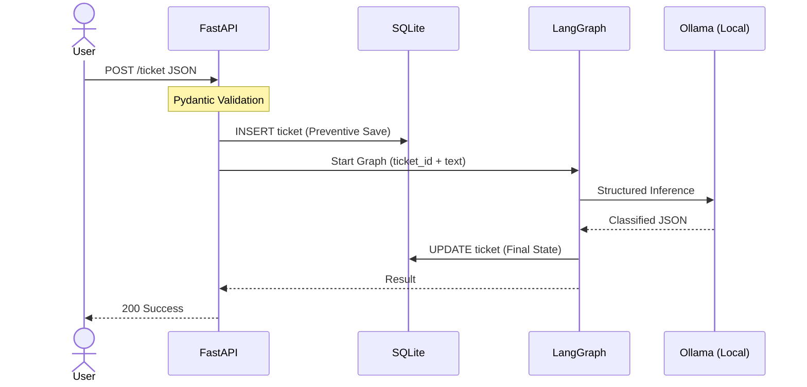
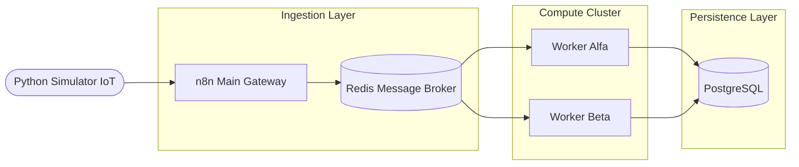

# Lead Automation Engineer & AI Systems Architect 👋
### Deterministic Agentic Workflows | Infrastructure Reliability | n8n Expert

 

+I+build+systems.;Architecting+Stateful+AI;Know+->+Do+->+Reflect;Engineering+Deterministic+Agents" alt="Typing SVG" />

---

### 🚀 Engineering Philosophy
> **Deterministic by Design.** I specialize in replacing fragile, linear scripts with **intelligence-driven architectures**. My focus is on building autonomous agents that operate within strict engineering guardrails, utilizing self-correction loops and state-machine logic to ensure 100% data integrity and system observability in mission-critical environments.

---

### 🛠️ Technical Arsenal

| **🧠 The Brain (AI)** | **⚙️ The Engine (Backend)** | **⚡ The Logic (Orch)** |
| :---: | :---: | :---: |
|     |     |     |

---

## 🏆 High-Impact Projects (Technical Case Studies)

 

### 🎫 [LangKit: Agentic AI Ticket Intelligence](https://github.com/IGabrielMolina/LangKit)
> **Engineering Focus:** Agentic Workflows, Service-Oriented Architecture (SOA), and Preventive Persistence.

A production-ready **Agentic Orchestrator** designed for local, privacy-first execution. I moved beyond simple prompts to build a resilient system that handles the inherent non-determinism of LLMs.

* **Deterministic Orchestration:** I engineered a Directed Acyclic Graph (DAG) via `LangGraph` to manage complex feedback loops and autonomous self-correction.
* **Fault-Tolerant Persistence:** I implemented a **Write-Ahead Logging** (WAL) pattern with SQLite. This ensures zero data loss by capturing state before and during inference cycles, protecting the system against hardware bottlenecks or API timeouts.
* **Strict Schema Enforcement:** Enforced rigid JSON outputs using `Pydantic` and Qwen 2.5 14B, eliminating hallucinations and ensuring downstream API compatibility.

 

### 🚀 [Industrial-Grade Data Ingestion Pipeline](https://github.com/IGabrielMolina/stress-test-mkn)
> **Engineering Focus:** Distributed Systems, Backpressure Management, and Fault Tolerance.

I architected this highly scalable pipeline to handle massive telemetry spikes. My focus was on decoupling the ingestion layer to prevent database exhaustion.

* **Decoupled Architecture:** I utilized **Redis** as a high-performance message broker to separate API ingestion from heavy database writes, effectively eliminating backpressure.
* **Asynchronous Scaling:** Engineered a cluster of isolated worker nodes that process high-volume loads (IoT/ERP migrations) in parallel without blocking the main gateway.

 

### 💳 [kitsu-fintech-engine: Autonomous Financial Pipeline](https://github.com/IGabrielMolina/kitsu-fintech-engine)
> **Engineering Focus:** Protocol Bridging, Asynchronous Scaling, and Deterministic Validation.

High-performance middleware bridging legacy financial protocols with modern AI orchestration. 

* **Legacy-to-Modern Bridge:** I designed a seamless integration between IMAP/SMTP legacy data and a modern REST API architecture.
* **Human-in-the-Loop (HITL):** I implemented risk-aware routing that triggers manual Slack-based approvals for high-value transactions before committing to PostgreSQL.

 

### 🦊 [Kitsu_Agent: Sovereign On-Premise AI Orchestrator](https://github.com/IGabrielMolina/Kitsu_agent)
> **Engineering Focus:** Security, Observability, and Data Sovereignty.

A secure **AI Orchestration Engine** featuring metadata-based RBAC. Designed for zero-egress environments where data privacy is non-negotiable. It runs `DeepSeek-R1` locally via Ollama ensuring 100% data sovereignty.

---

  
📍 Based in Argentina (UTC-3) 🇦🇷

  
🌍 <b>Optimized for EMEA/UK/US business hours</b>

  
🚀 Open for Global Engineering Opportunities | <b>LET'S BUILD.</b>

